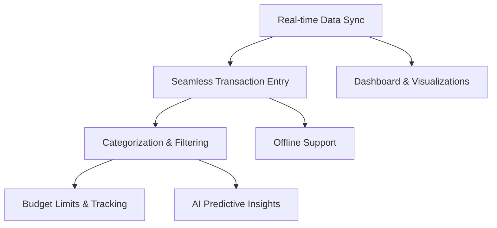

# Feature Research

**Domain:** Expense Tracking Mobile and Web Application
**Researched:** 2026-08-23
**Confidence:** HIGH

## Feature Landscape

### Table Stakes (Users Expect These)

Features users assume exist. Missing these = product feels incomplete.

| Feature | Why Expected | Complexity | Notes |
|---------|--------------|------------|-------|
| Seamless Transaction Entry | Users need a frictionless way to record expenses on the go (mobile) and at their desk (web). | LOW | Manual entry with smart defaults; category and date fields. |
| Dashboard & Visualizations | Clear "Money In vs. Money Out" overview. Users expect to see their financial health at a glance. | MEDIUM | Pie/bar charts for categories over custom date ranges. |
| User Authentication | Must securely log in and access data across both web and mobile devices. | LOW | Firebase Auth handles this. Cross-platform persistence is key. |
| Real-time Data Sync | If a user adds an expense on mobile, they expect it to immediately appear on the web dashboard. | LOW | Firebase Firestore naturally supports this real-time sync. |
| Categorization & Filtering | Users need to group expenses to understand spending habits. | LOW | Predefined + custom categories. |
| Budget Limits & Tracking | Users track expenses to stick to budgets. Need to set limits per category. | MEDIUM | Visual progress bars. |
| Offline Support (Mobile) | Users may want to add an expense while offline (e.g., in a subway or on a flight) and expect it to sync later. | MEDIUM | Firestore offline persistence needed for React Native. |

### Differentiators (Competitive Advantage)

Features that set the product apart. Not required, but valuable.

| Feature | Value Proposition | Complexity | Notes |
|---------|-------------------|------------|-------|
| Receipt Scanning (OCR) | Eliminates manual data entry. Massive time saver for users. | HIGH | Use device camera and OCR libraries. |
| Multi-Account & Currencies | Essential for travelers, expats, and users with multiple bank accounts or crypto. | HIGH | Needs exchange rate API. |
| Voice-Based Logging | Natural language input (e.g., "Spent $15 on lunch") for hands-free, rapid entry. | HIGH | Voice-to-text + LLM parsing. |
| AI Predictive Insights | "You spend 30% more on weekends." Proactive advice drives retention. | HIGH | Requires data analysis and pattern recognition. |
| Shared Wallets / Split Bills | Great for couples or roommates. Creates viral loops as users invite others. | HIGH | Requires complex data sharing rules. |

### Anti-Features (Commonly Requested, Often Problematic)

Features that seem good but create problems.

| Feature | Why Requested | Why Problematic | Alternative |
|---------|---------------|-----------------|-------------|
| Full Bank Auto-Sync | Users hate manual entry. | Extremely complex to build and maintain (Plaid etc. have high costs/errors). | Receipt scanning and smart manual entry. |
| Social Feed of Expenses | Venmo-style social validation. | Privacy concerns; most people don't want to share financial details. | Private shared wallets with specific trusted users. |

## Feature Dependencies

### Dependency Notes

- **Dashboard & Visualizations requires Real-time Data Sync:** Dashboards are useless if they don't reflect the latest state across devices.
- **Budget Limits requires Categorization:** Budgets are typically tracked per category.
- **Offline Support enhances Transaction Entry:** Ensures no friction even without connectivity.

## MVP Definition

### Launch With (v1)

Minimum viable product — what's needed to validate the concept and maintain parity with the Angular app.

- [x] Seamless Transaction Entry — Core purpose of the app.
- [x] Dashboard & Visualizations — Required to provide immediate value/feedback to the user.
- [x] Real-time Data Sync — Essential for the cross-platform (mobile + web) experience.
- [x] Categorization & Filtering — Necessary for basic reporting.
- [x] User Authentication — Privacy and multi-device access.

*(Note: These align with the existing Angular app's features)*

### Add After Validation (v1.x)

Features to add once core is working.

- [ ] Offline Support (Mobile) — High value for mobile users, can be added post-launch.
- [ ] Budget Limits & Tracking — Natural next step for users wanting to control spending.

### Future Consideration (v2+)

Features to defer until product-market fit is established.

- [ ] Receipt Scanning (OCR) — High effort, adds "wow" factor but not strictly necessary for v1.
- [ ] Multi-Account & Currencies — Targets a narrower demographic.
- [ ] Shared Wallets — Significant architectural complexity.

## Feature Prioritization Matrix

| Feature | User Value | Implementation Cost | Priority |
|---------|------------|---------------------|----------|
| User Auth & Sync | HIGH | LOW | P1 |
| Transaction Entry | HIGH | LOW | P1 |
| Dashboards/Reports | HIGH | MEDIUM | P1 |
| Categorization | HIGH | LOW | P1 |
| Offline Support (Mobile)| HIGH | MEDIUM | P2 |
| Budgeting | MEDIUM | MEDIUM | P2 |
| Receipt OCR | HIGH | HIGH | P3 |
| Shared Wallets | MEDIUM | HIGH | P3 |
| Voice Logging | LOW | HIGH | P3 |

**Priority key:**
- P1: Must have for launch
- P2: Should have, add when possible
- P3: Nice to have, future consideration

## Competitor Feature Analysis

| Feature | Splitwise | Mint (Monarch/YNAB) | Our Approach |
|---------|-----------|---------------------|--------------|
| Target Use Case | Shared expenses & splitting | Personal budgeting & net worth | Fast, manual personal tracking across mobile & web |
| Data Entry | Manual | Auto-sync (Plaid) | Fast Manual + Planned OCR |
| Analytics | Basic balances | Deep historical trends | Interactive dashboard with real-time sync |

## Edge Cases / Overlooked Considerations

- **Cross-Platform UI/UX:** A "table stakes" UI pattern on mobile (bottom tabs) often doesn't translate perfectly to web (sidebars). React Native Web needs careful responsive design.
- **Offline Writes Conflict Resolution:** If a user edits an expense offline on mobile, and someone edits the same expense on the web, how is the conflict handled when the mobile device reconnects? (Firestore handles basic timestamp-based resolution, but UI feedback is needed).
- **Timezone Handling:** If an expense is entered at 11 PM on the West Coast, is it recorded as today or tomorrow on the East Coast? This affects daily budget calculations.

## Sources

- General market analysis of Expense Tracking Apps
- User expectation norms for cross-platform applications
- PROJECT.md context (Angular parity)

---
*Feature research for: Expense Tracking Mobile and Web Application*
*Researched: 2026-08-23*
