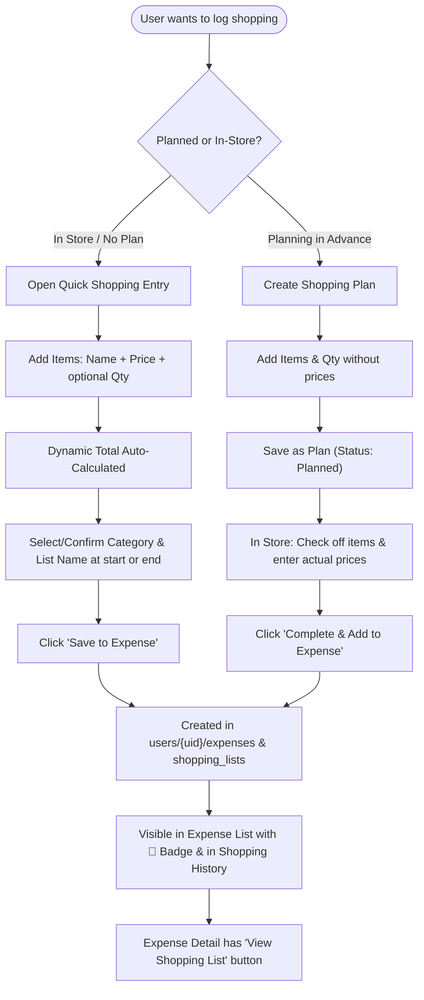

# Implementation Plan - Shopping & Grocery Lists Feature

## Goal Description
Introduce a unified **Shopping & Grocery Lists** feature in Expense Expert that supports two complementary workflows:
1. **Unplanned / In-Store Quick Entry:** When at the store or grocery without a prior plan, open the form to quickly log items and prices (with optional quantities) one by one, pick or adjust the name/category (at the start or right at the end), and immediately save as an expense with the calculated total.
2. **Planned Ahead Checklist:** Prepare a shopping plan in advance (items and optional quantities, prices empty/0), use it as an in-store checklist, enter prices as you pick up items, and convert it to an expense upon checkout.

Both workflows produce an itemized shopping history linked with the core Expense tracker, complete with two-way synchronization and cascading deletion.

---

## User Review Required

> [!IMPORTANT]
> - **Dual Entry Workflows**:
>   - **Direct In-Store Mode:** Direct item-by-item entry (Name + Price + optional Qty) with instant total calculation, allowing category and name selection at either the beginning or end, followed by one-click **"Save to Expense"**. No prior planning stage required.
>   - **Planning Mode:** Enter items without prices ahead of time, check off in store, enter prices, and complete.
> - **Access from "+ Add Expense"**:
>   - On the standard Add Expense screen (`/expenses/new`), users can switch between **"Simple Expense"** and **"Itemized Shopping"** with a single click, or access it from the **"🛒 Shopping"** button on the Expenses list page.
> - **Cascade Deletion**:
>   - Deleting a shopping list deletes its linked expense record, and deleting an expense created from a shopping list deletes the linked shopping list.

---

## Architecture & User Flows



---

## Proposed Changes

### Core Models & Services Layer

#### [NEW] `expense-expert/src/app/core/models/shopping-list.model.ts`
* Defines `ShoppingItem`:
  ```typescript
  export interface ShoppingItem {
    id: string;
    name: string;
    quantity?: string; // e.g. "1 dozen", "2 kg", "3 packs" (optional)
    price: number;     // line price (0 while planning, filled in store)
    checked: boolean;  // checklist flag for in-store crossing off
  }
  ```
* Defines `ShoppingListStatus`: `'planned' | 'completed'`.
* Defines `ShoppingList`:
  ```typescript
  export interface ShoppingList {
    id: string;
    name: string;
    category: ExpenseCategory;
    date: Date;
    status: ShoppingListStatus;
    items: ShoppingItem[];
    totalAmount: number;
    expenseId: string | null;
    createdAt: Date;
    updatedAt: Date;
  }
  ```
* Defines `CreateShoppingListDto` and `UpdateShoppingListDto`.

#### [MODIFY] `expense-expert/src/app/core/models/expense.model.ts`
* Add optional fields to `Expense`, `CreateExpenseDto`, and `UpdateExpenseDto`:
  * `shoppingListId?: string | null;`
  * `shoppingListName?: string | null;`

#### [NEW] `expense-expert/src/app/core/services/shopping-list.service.ts`
* Collection path: `users/{uid}/shopping_lists`
* Methods:
  * `getShoppingLists(): Observable<ShoppingList[]>` – Streams all shopping lists ordered by `date` desc.
  * `getShoppingListById(id: string): Observable<ShoppingList>` – Streams single shopping list.
  * `createShoppingList(dto: CreateShoppingListDto): Promise<string>` – Creates a new shopping list.
  * `saveDirectShoppingExpense(data: { name: string; category: ExpenseCategory; date: Date; items: ShoppingItem[]; totalAmount: number }): Promise<{ shoppingListId: string; expenseId: string }>` – **Instant In-Store Flow**: Creates the shopping list with status `'completed'` AND creates the linked `Expense` simultaneously in a single coordinated action.
  * `updateShoppingList(id: string, dto: UpdateShoppingListDto): Promise<void>` – Updates shopping list and syncs linked expense if existing.
  * `completeShoppingList(list: ShoppingList): Promise<string>` – Converts an existing planned list to `'completed'` and creates the linked expense.
  * `deleteShoppingList(id: string, expenseId?: string | null): Promise<void>` – Deletes shopping list and cascades deletion to the linked expense.
  * `deleteShoppingListDocOnly(id: string): Promise<void>` – Internal helper called by `ExpenseService` to prevent circular cascade loops.

#### [MODIFY] `expense-expert/src/app/core/services/expense.service.ts`
* In `addExpense()`: Pass through `shoppingListId` and `shoppingListName`.
* In `deleteExpense(id: string)`: If the expense has `shoppingListId`, also delete the corresponding shopping list record.

---

### UI Components Layer (`src/app/features/expenses/shopping/`)

#### [NEW] `expense-expert/src/app/features/expenses/shopping/shopping.routes.ts`
* Routes:
  * `''` -> `ShoppingListComponent`
  * `'new'` -> `ShoppingFormComponent`
  * `':id'` -> `ShoppingFormComponent`

#### [NEW] `expense-expert/src/app/features/expenses/shopping/shopping-list/shopping-list.component.ts`
* Header with title *"Shopping & Grocery"*, "+ New Shopping List" button, and back link to `/expenses`.
* Filter tabs: **All**, **Planned** (advance plans), **Completed** (completed shopping trips added to expenses).
* Card list displaying:
  * List Name & Category badge.
  * Date.
  * Item count and checked progress (e.g. *8 items*).
  * Calculated total amount.
  * Status badge (`Planned` vs `Completed`).
  * Action buttons: Open / Edit / Delete.
* Empty states with quick action to create first list.

#### [NEW] `expense-expert/src/app/features/expenses/shopping/shopping-form/shopping-form.component.ts`
* Designed for both **unplanned in-store entry** and **planned list creation**:
  * **Top Bar**: List Name (defaults to e.g. *"Grocery Shopping"*, editable anytime) and Date picker.
  * **Category Selector**: Easy category card or dropdown (defaults to `Food`), selectable at the start or changed right before saving.
  * **Fast-Entry Item Table / List**:
    * Checkbox to cross off items.
    * Item Name (e.g. *"Milk"*, *"Apples"*, *"Dish soap"*).
    * Quantity (optional text, e.g. *"2 kg"*, *"1 box"*, *"3"*).
    * Price (number input).
    * Delete button (trash icon).
    * **Keyboard Ergonomics**: Typing the price and pressing <kbd>Enter</kbd> instantly adds a new empty item row and moves focus to the item name, making in-store item scanning/entry lightning fast.
  * **Live Summary & Actions Footer**:
    * Real-time total: **`Total: $XX.XX`** (updates on every keystroke).
    * **"Save as Expense"** button (primary, green): Validates total > 0, creates expense, saves shopping record as completed, and shows success toast.
    * **"Save as Plan"** button (secondary, outline): Saves items without requiring prices for future shopping trips.

---

### Expense Integration Layer

#### [MODIFY] `expense-expert/src/app/features/expenses/expenses.routes.ts`
* Register child route `shopping` -> `SHOPPING_ROUTES`.

#### [MODIFY] `expense-expert/src/app/features/expenses/expense-list/expense-list.component.ts`
* Add **"🛒 Shopping"** button in header toolbar beside "Drafts".
* In expense items list: Show shopping cart badge 🛒 with list name for expenses originating from shopping trips.

#### [MODIFY] `expense-expert/src/app/features/expenses/expense-detail/expense-detail.component.ts`
* Show shopping badge and list name.
* Add **"View Shopping List"** button that navigates directly to `/expenses/shopping/:shoppingListId`.

#### [MODIFY] `expense-expert/src/app/features/expenses/expense-form/expense-form.component.ts`
* In the Expense Form header / step 1: Add a quick switcher banner:
  *"Buying multiple grocery or shopping items? [Use Itemized Shopping List →]"* linking to `/expenses/shopping/new`.

---

## Verification Plan

### Automated Build & Test Verification
1. Install dependencies:
   ```bash
   npm install
   ```
2. Run Angular CLI build to verify TypeScript types and template compilation:
   ```bash
   npm run build
   ```
3. Run test suite:
   ```bash
   npm test -- --watch=false --browsers=ChromeHeadless
   ```

### Manual Verification
1. **Unplanned In-Store Flow (Your exact scenario):**
   * Go to `/expenses` -> click **"🛒 Shopping"** -> **"+ New Shopping List"** (or switch from Add Expense).
   * Notice default name *"Grocery Shopping"* and category *"Food"*.
   * Add Item 1: Name = *"Apples"*, Price = `4.50`, Qty = *"1 bag"*. Press <kbd>Enter</kbd>.
   * Add Item 2: Name = *"Chicken Breast"*, Price = `12.00`, Qty = *"2 lbs"*. Press <kbd>Enter</kbd>.
   * Add Item 3: Name = *"Olive Oil"*, Price = `8.50`.
   * Verify calculated total displays `$25.00`.
   * Click **"Save as Expense"**.
   * Verify:
     * Redirects to `/expenses`.
     * An expense for `$25.00` under *"Food"* titled *"Grocery Shopping"* with a 🛒 Shopping List badge exists.
     * Shopping list history shows it under the **Completed** tab with full 3-item breakdown.
2. **Planned Ahead Flow:**
   * Create a list with 2 items with $0 prices, click **"Save as Plan"**.
   * Verify it appears in **Planned** tab.
   * Open it, check off items, enter prices, click **"Complete & Add to Expense"**.
   * Verify linked expense is created.
3. **Detail & Sync:**
   * Open Expense Detail -> click **"View Shopping List"** -> edits update the linked expense.
4. **Cascade Delete:**
   * Delete expense -> linked shopping list is removed; delete shopping list -> linked expense is removed.
